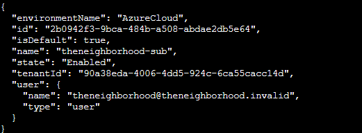
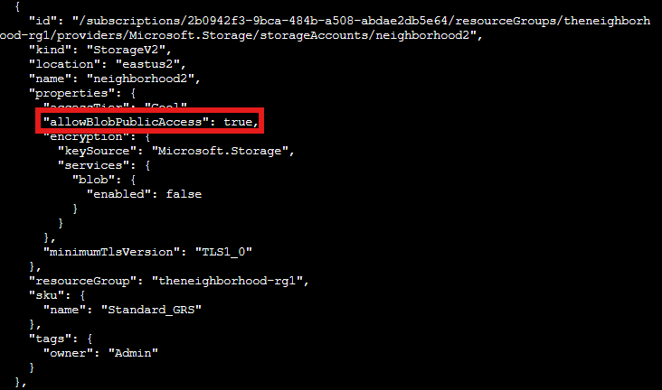
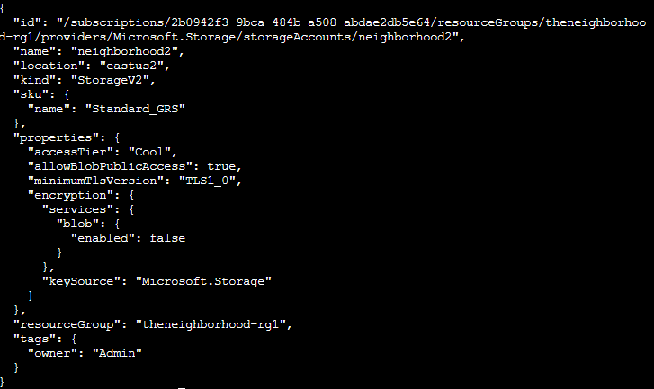
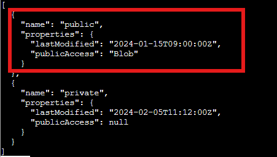
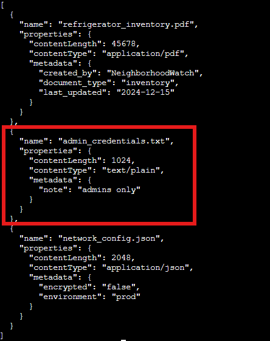
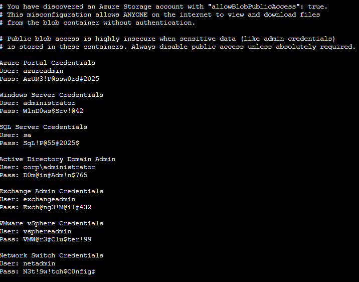

# Act 1: Blob storage challenge in the neighborhood

**Difficulty**: :fontawesome-solid-star::fontawesome-regular-star::fontawesome-regular-star::fontawesome-regular-star::fontawesome-regular-star: 

## Objective

!!! question "Request"
    Help the Goose Grace near the pond find which Azure Storage account has been misconfigured to allow public blob access by analyzing the export file.

??? quote "Grace"
    The Neighborhood HOA uses Azure storage accounts for various IT operations.
    You've been asked to audit their storage security configuration to ensure no sensitive data is publicly accessible.
    Recent security reports suggest some storage accounts might have public blob access enabled, creating potential data exposure risks.

Let's audit the access policies for Azure storage accounts  to ensure no sensitive data is publicly accessible.

## Solution

1. explore the account you have access to  
`az account show` 

2. Examine the azure storage accounts: 
`az storage account list | less` 

One shows the most common misconfiguration, which is a publicly accessible storage account. 

3. Examine that storage account: 
`az storage account show --name neighboorhood2` 

4. List containers in neighborhood2: 
`az storage container list --account-name neighborhood2 --auth-mode login|less` 

One of them is publicly accessible

5.  Look at blob list in the public container for neighborhood2 
`az storage blob list --container-name 'public' --account-name neighborhood2 --auth-mode login -o table` 

We see an interesting file: `admin_credentials.txt` 

6.  Download the credentials file and read it 
`az storage blob download --container-name 'public' --name admin_credentials.txt   --account-name neighborhood2  --file  /dev/stdout | less` 

