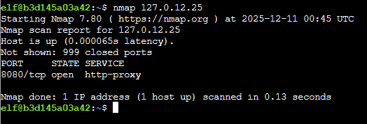
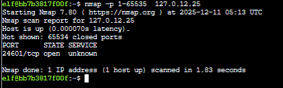
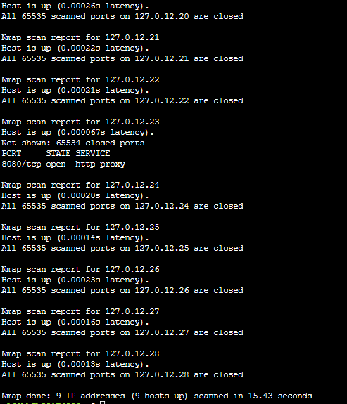
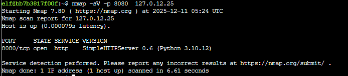
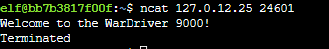

# Act 1: Intro to Nmap

**Difficulty**: :fontawesome-solid-star::fontawesome-regular-star::fontawesome-regular-star::fontawesome-regular-star::fontawesome-regular-star: 

## Objective

!!! question "Request"
    Meet Eric in the hotel parking lot for Nmap know-how and scanning secrets. Help him connect to the wardriving rig on his motorcycle!

??? quote "Eric Pursley"
    Speaking of tools, let me introduce you to one of the most essential weapons in any pentester's arsenal: Nmap.  
    It's like having X-ray vision for networks, and I've set up a perfect environment for you to learn the fundamentals.  
    Help me find and connect to the wardriving rig's service on my motorcycle!  

The goal here is to learn how to use Nmap to find and connect to the wardriving rig's service.

## Solution

We first performs a TCP port scan of the top 1000 ports. 
`nmap 127.0.12.25` 

We can extend the search to explore all ports. 
`nmap -p 1-65535  127.0.12.25` 

Let's now scan for a range of IP addresses: 
`nmap -p 1-65535  127.0.12.20-28` 

Let's determine what version of service is running on port 8080 
` nmap -sV -p 8080 127.0.12.25` 

Finally, we can interact with the service using ncat 
`ncat 127.0.12.25 24601` 
