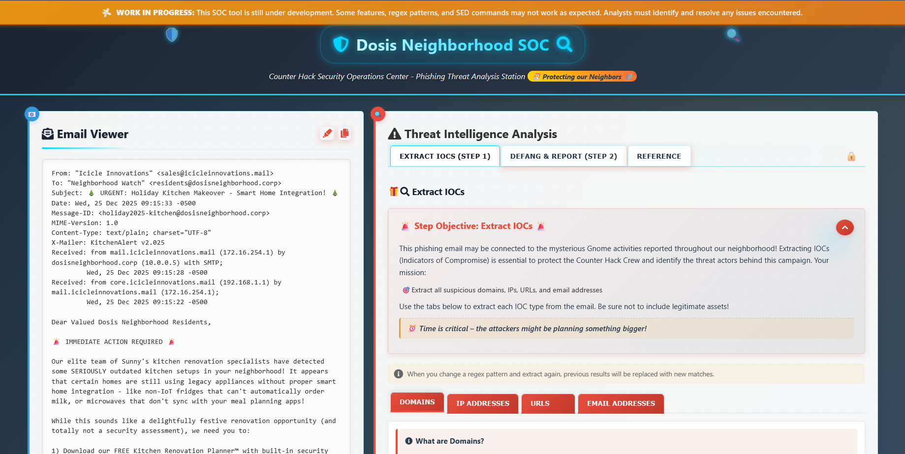
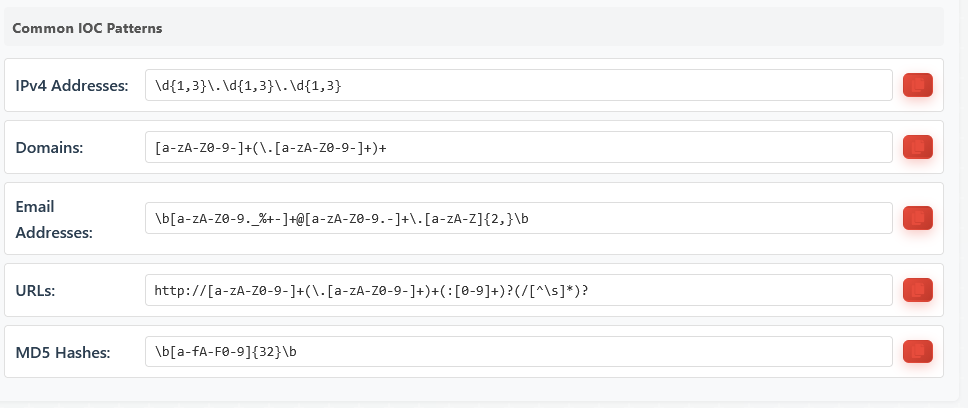
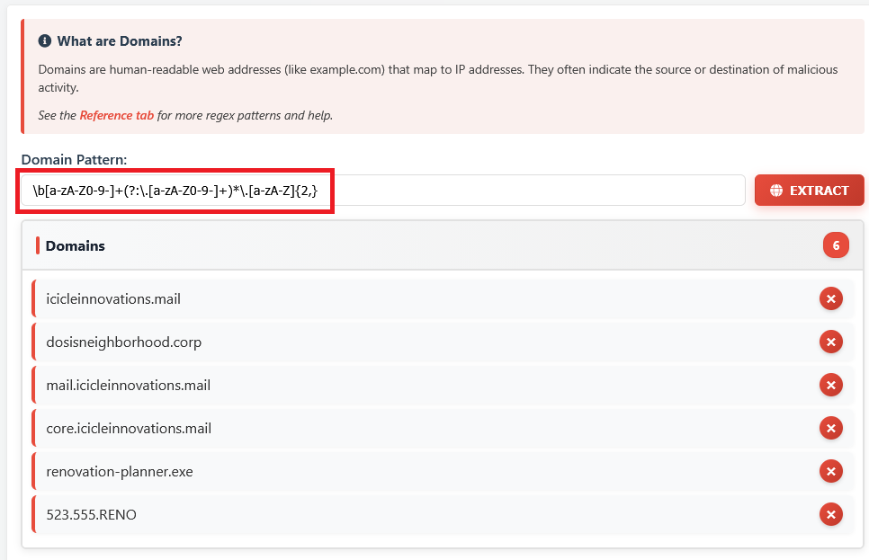
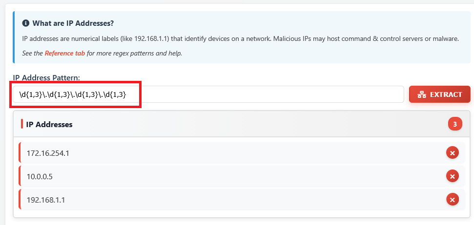
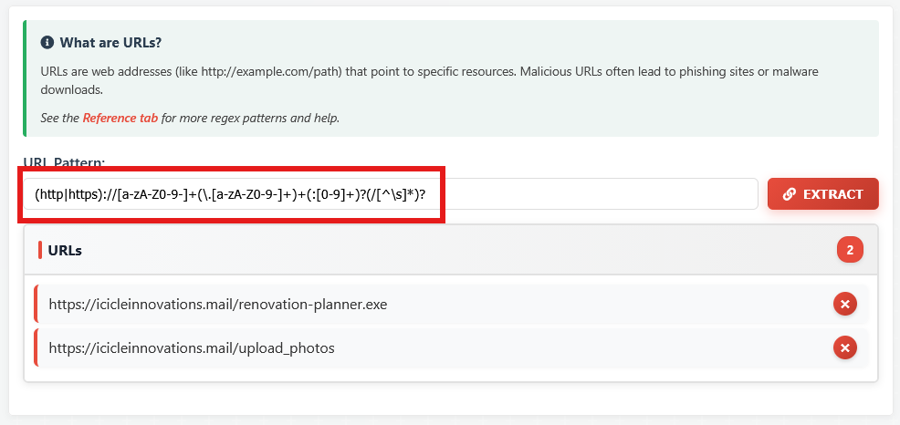
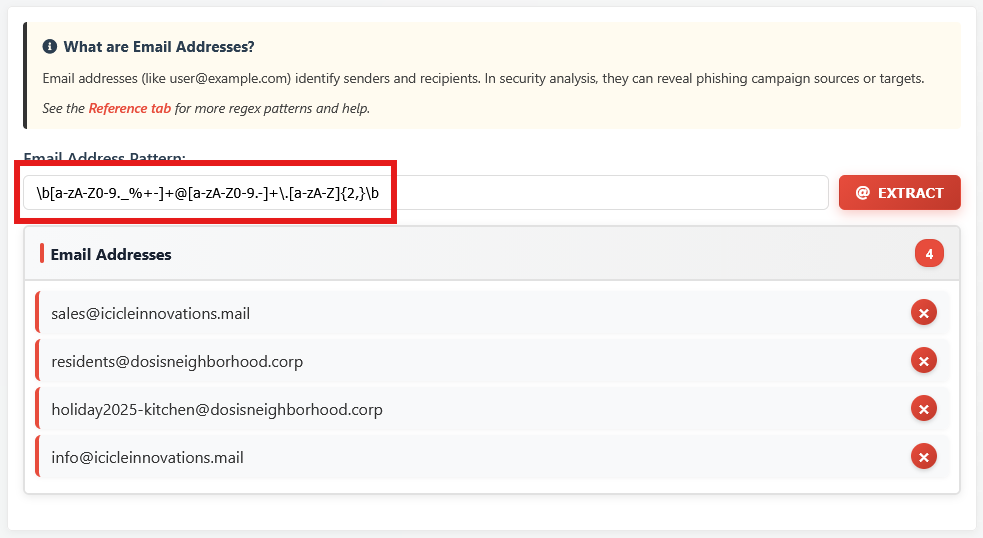
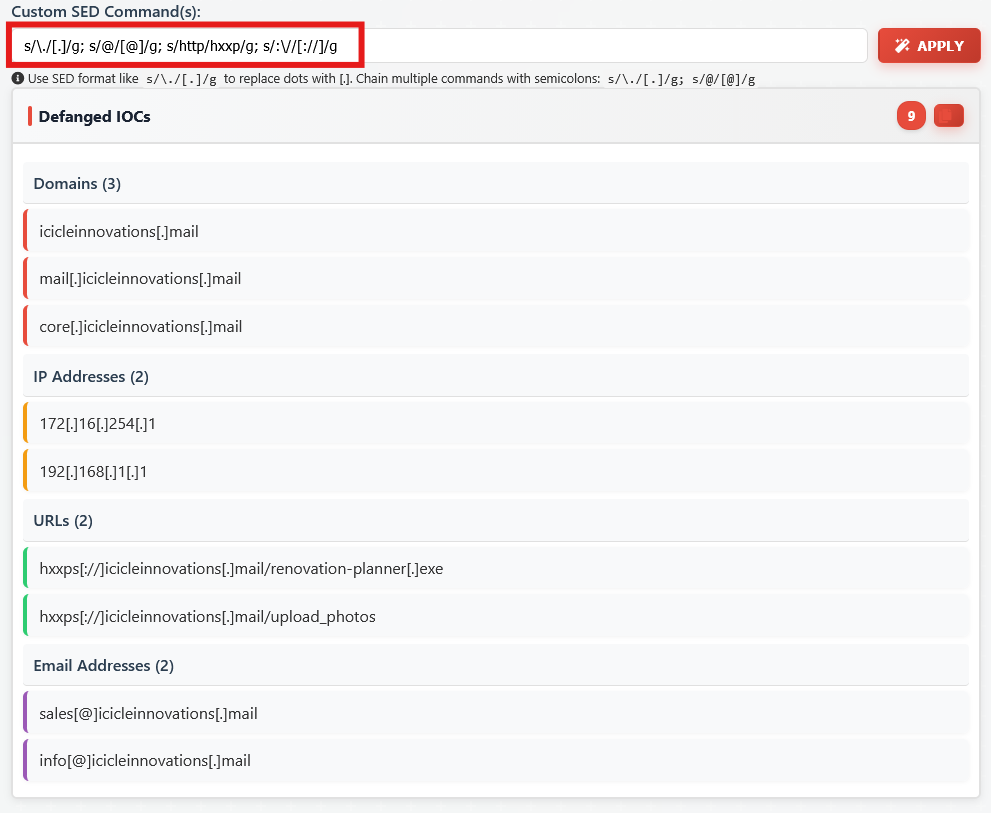
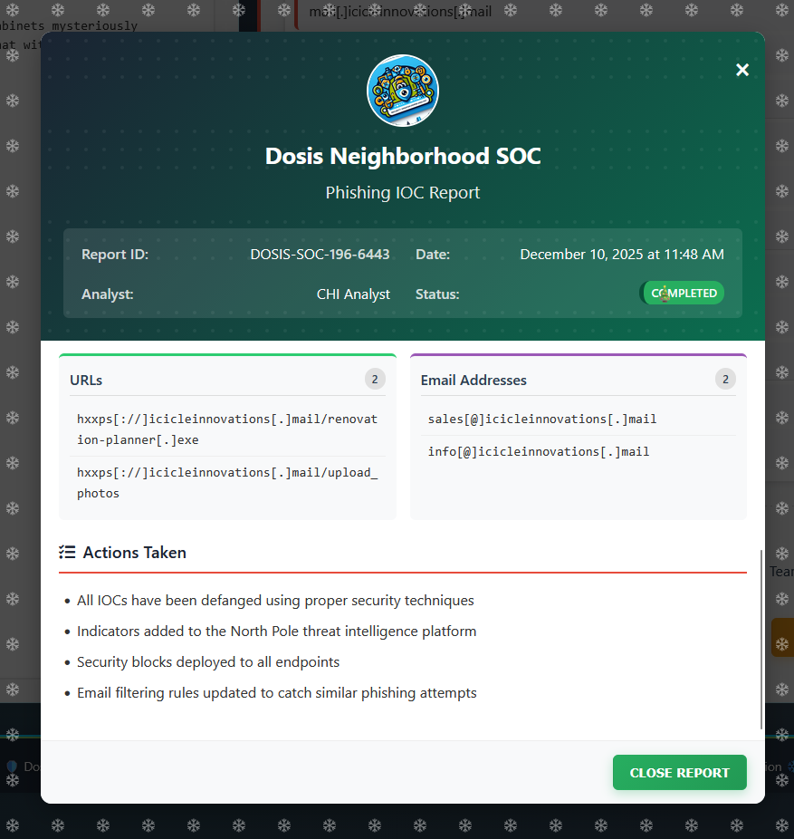

# It's all about Defang

**Difficulty**: :fontawesome-solid-star::fontawesome-regular-star::fontawesome-regular-star::fontawesome-regular-star::fontawesome-regular-star: 

## Objective

!!! question "Request"
    Find Ed Skoudis upstairs in City Hall and help him troubleshoot a clever phishing tool in his cozy office.

??? quote "Ed Skoudis"
    The team has been working on this new SOC tool that helps triage phishing emails...and there are some...issues.  
    We have had some pretty sketchy emails coming through and we need to make sure we block ALL of the indicators of compromise. 

So our goal is to block all the indicators of compromise in the incoming phishing emails using the Dosis neighborhood SOC, which has a couple of limitations.

## Solution

The SOC tool shows an email viewer on the left, and details of the threat analysis performed on the right.

However, the pre-configured regex patterns presented below do not allow to extract the correct information:

!!! info "Regex"
    An interesting resource to test regex patterns online is [https://regex101.com/](https://regex101.com/).

After correction of the regex patterns, we obtain the following data:

### Domains

### IP addresses

### Urls

### Email addresses

### Defang all the things

It is required to defang all the indicators of compromise to prevent users or automated systems from inadvertently triggering them.

For this the **sed** command is particularly useful.

After submitting the properly formatted IOCs, we are faced with a Success screen for this objective.

