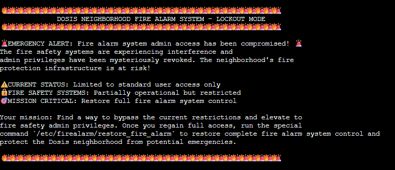
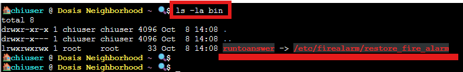
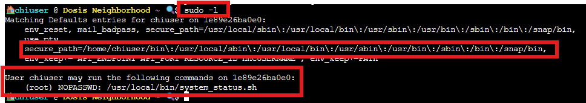
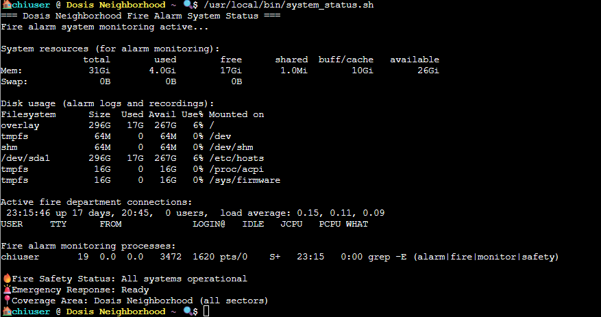
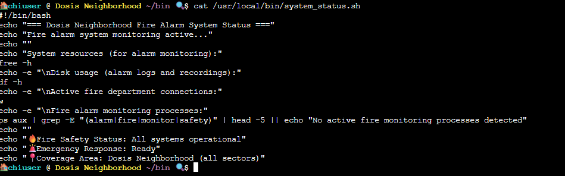
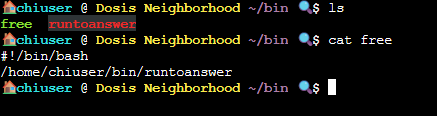
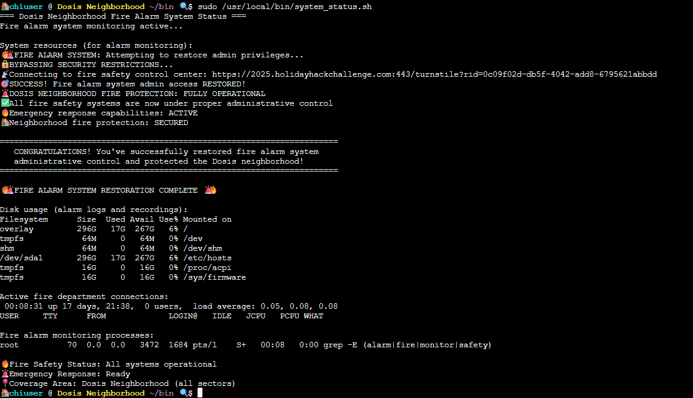

# Neighborhood watch bypass

**Difficulty**: :fontawesome-solid-star::fontawesome-regular-star::fontawesome-regular-star::fontawesome-regular-star::fontawesome-regular-star: 

## Objective

!!! question "Request"
    Assist Kyle at the old data center with a fire alarm that just won't chill.

??? quote "Kyle Parrish"
    This fire alarm keeps going nuts but there's no fire. I checked.  
    I think someone has locked us out of the system. Can you see if you can get back in?

We have to find a way to bypass the current restriction of the fire alarm and elevate to the admin privileges and restore the system.

## Solution

This is a terminal challenge, so we will have to make good use of the command line interface.

Upon doing a little reconnaissance, we notice that we have a symlink pointing to the executable we want to launch to restore the system.

Let's take a look at the privileges we have in that terminal.

Turns out we can execute a program to get the status of the fire alarm system.
The system also looks for executable inside the **/bin** folder of the current user.

When reading this file, we notice that the system status executable makes use of the **free** command.

When entering the name of an executable in the command line, the PATH environment variable is read from left to right to find the location of the program to run. 

What if we could create a fake **free** executable containing the instructions to run the executable **/etc/firealarm/restore_fire_alarm**?
We would also need to put that fake program at one of the first locations enumerated in the PATH, for instance, our **/bin** folder.
By doing this, upon checking for the fire alarm status, we would trigger the execution of the restoration program too.

## The problem

An attacker can trick your program into running the wrong script by abusing the PATH environment variable, when absolute paths are not used.