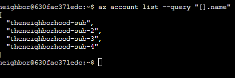
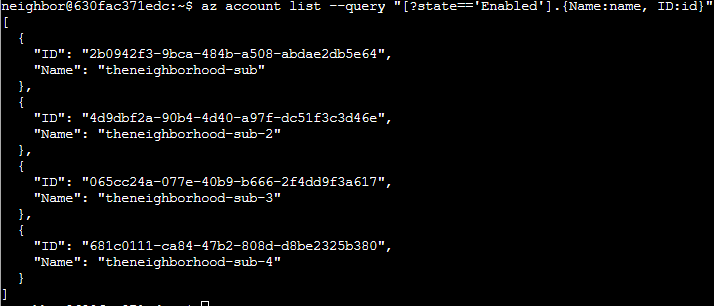
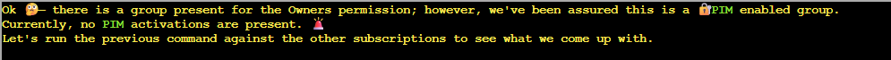
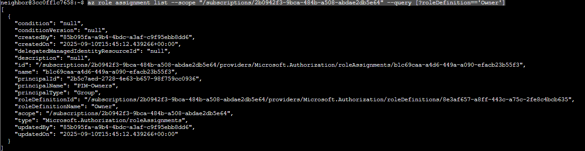
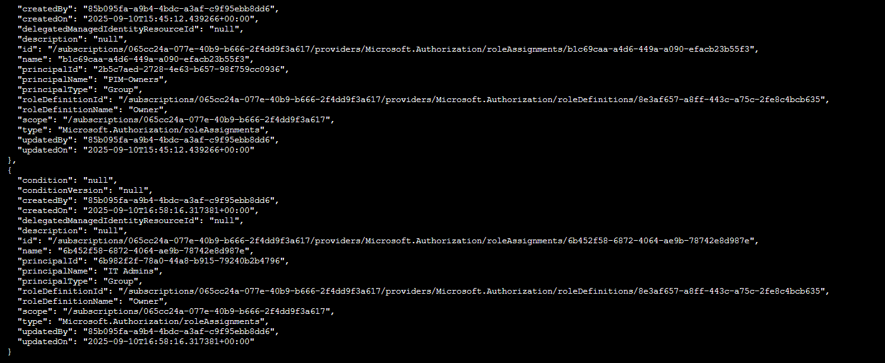
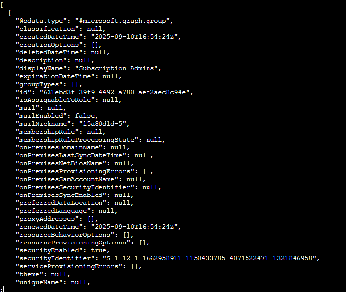
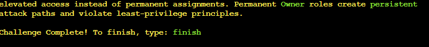
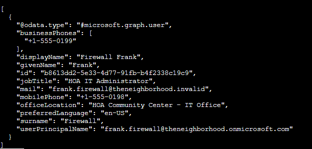

# Act 1: Owner

**Difficulty**: :fontawesome-solid-star::fontawesome-regular-star::fontawesome-regular-star::fontawesome-regular-star::fontawesome-regular-star: 

## Objective

!!! question "Request"
    Help Goose James near the park discover the accidentally leaked SAS token in a public JavaScript file and determine what Azure Storage resource it exposes and what permissions it grants.

??? quote "James"
    The Neighborhood HOA uses Azure for their IT infrastructure. 
    The Neighborhood network admins use RBAC fo access control. 
    Your task is to audit their RBAC configuration to ensure they're following security best practices. 
    They claim all elevated access uses PIM, but you need to verify there are no permanently assigned Owner roles.

## Solution

- Explore and list the account name  
`az account list --query "[].name"` 

- Explore more: 
`az account list --query "[?state=='Enabled'].{Name:name, ID:id}"` 

- Exploring the owner of the first listed subscription 
`az role assignment list --scope "/subscriptions/2b0942f3-9bca-484b-a508-abdae2db5e64" --query [?roleDefinition=='Owner']` 
 

- By exploring the other accounts, we notice that one of them does not just have PIM activated, but something else 
`az role assignment list --scope "/subscriptions/065cc24a-077e-40b9-b666-2f4dd9f3a617" --query [?roleDefinition=='Owner']` 

- Let's examine the memberships for that group 
`az ad member list --group 6b982f2f-78a0-44a8-b915-79240b2b4796 |less` 

- Run the command again against that nested group 
`az ad member list --group 631ebd3f-39f9-4492-a780-aef2aec8c94e |less` 
 
