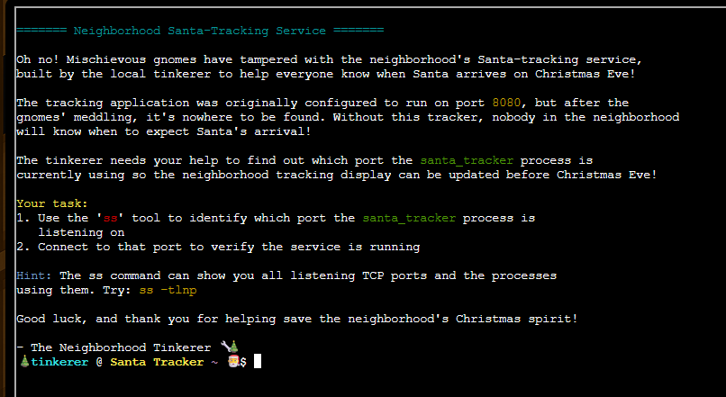
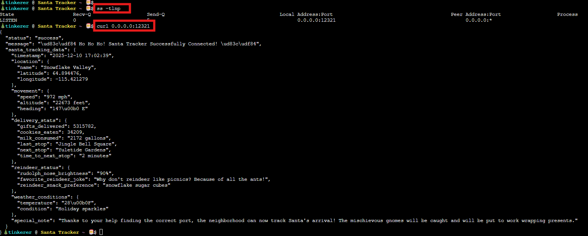

# Santa's Gift-tracking service port mystery

**Difficulty**: :fontawesome-solid-star::fontawesome-regular-star::fontawesome-regular-star::fontawesome-regular-star::fontawesome-regular-star: 

## Objective

!!! question "Request"
    Chat with Yori near the apartment building about Santa's mysterious gift tracker and unravel the holiday mystery.

??? quote "Yori Kvitchko"
    Think you can check out this terminal for me? I need to use cURL to access the gift tracker system, but it has me stumped.

Gnomes have tampered with the tracking service, whose original port was 8080. We need to find the new port on which it currently runs and access the tracker.

## Solution
It is actually solved by a couple of command lines as shown below.

