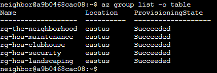
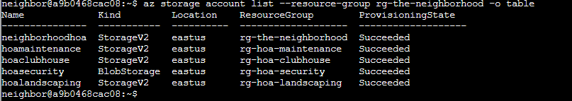
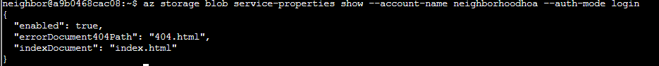
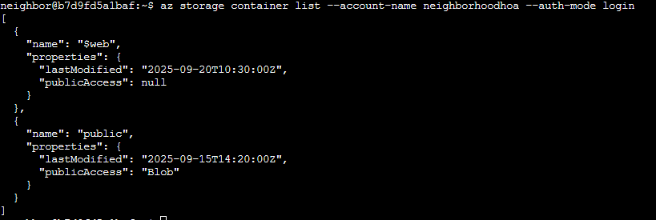
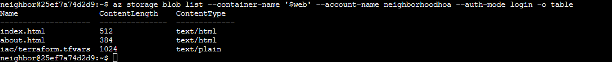
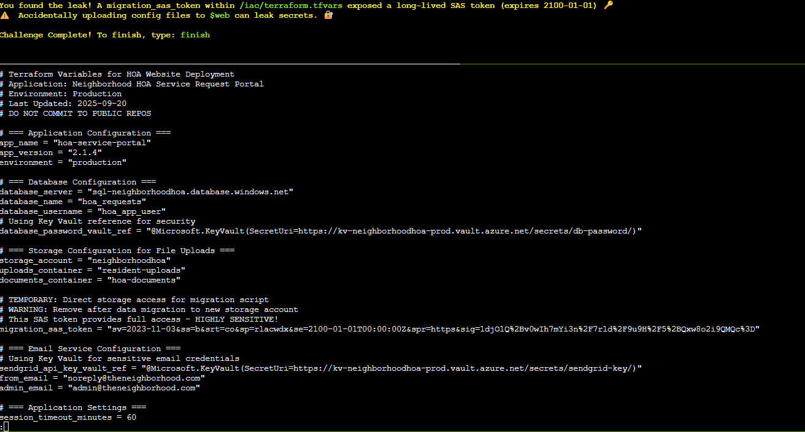

# Act 1: Spare key

**Difficulty**: :fontawesome-solid-star::fontawesome-regular-star::fontawesome-regular-star::fontawesome-regular-star::fontawesome-regular-star: 

## Objective

!!! question "Request"
    Help Goose Barry near the pond identify which identity has been granted excessive Owner permissions at the subscription level, violating the principle of least privilege.

??? quote "Barry"
    The Neighborhood HOA hosts a static website on Azure Storage. 
    An admin accidentally uploaded an infrastructure config file that contains a long-lived SAS token. 
    Use Azure CLI to find the leak and report exactly where it lives.

Find the location of a spare key left in the open on an Azure CLI session in "The Neighborhood" tenant

## Solution

Exploration: 
- List all the resource groups  
`az group list -o table ` 

- Find storage accounts in the neighborhood resource group 
`az storage account list --resource-group rg-the-neighborhood -o table` 

- Explore the properties of the accounts available to determine if one of the storage contains a static website 
`az storage blob service-properties show --account-name neighborhoodhoa --auth-mode login` 

- Identify what containers are available in the storage account and its public access levels 
`az storage container list --account-name neighborhoodhoa --auth-mode login` 

- Explore the files in the static website container and look for files that should not be publicly accessible 
`az storage blob list --container-name '$web' --account-name neighborhoodhoa --auth-mode login -o table` 

- Read the suspect the file 
`az storage blob download --container-name '$web' --name iac/terraform.tfvars   --account-name neighborhoodhoa  --file  /dev/stdout | less` 
