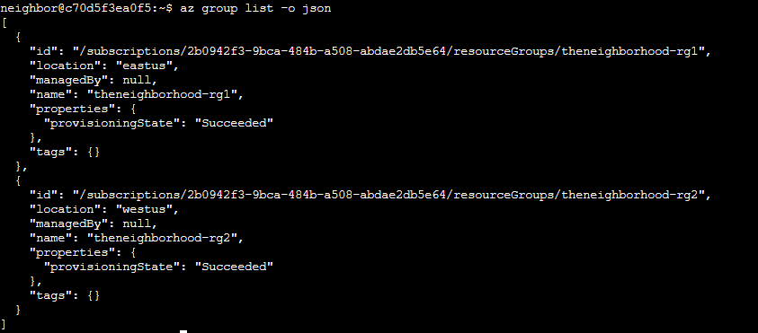
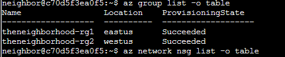
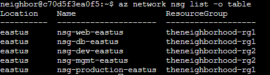
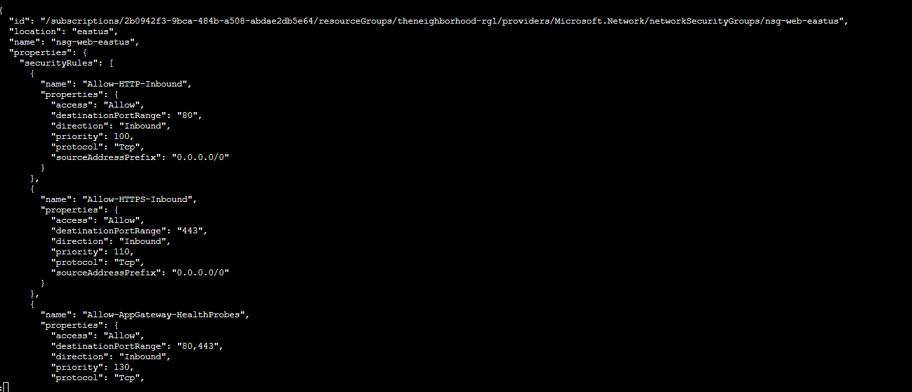
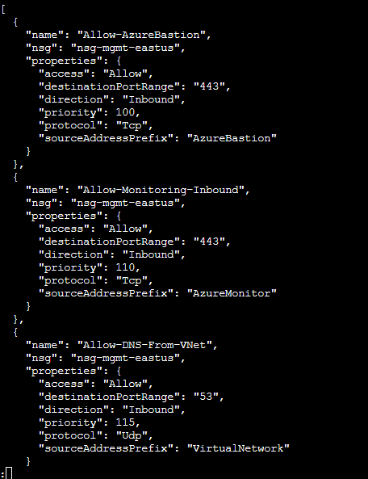
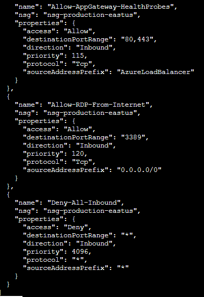

# Act 1: The open door

**Difficulty**: :fontawesome-solid-star::fontawesome-regular-star::fontawesome-regular-star::fontawesome-regular-star::fontawesome-regular-star: 

## Objective

!!! question "Request"
    Help Goose Lucas in the hotel parking lot find the dangerously misconfigured Network Security Group rule that's allowing unrestricted internet access to sensitive ports like RDP or SSH.

??? quote "Lucas"
    Please make sure the towns Azure network is secured properly. 
    The Neighborhood HOA uses Azure for their IT infrastructure. 
    Audit their network security configuration to ensure production systems aren't exposed to internet attacks. 
    They claim all systems are properly protected, but you need to verify there are no overly permissive NSG rules.

## Solution

- See the resources group in json format 
`az group list -o json` 

- Show it in table format now 
`az group list -o table` 
![[Capture d'écran 2025-12-11 133043.png]]

- Let's list all NSGs across resource groups 
`az network nsg list -o table` 

- Inspect the security group "web" and show the details 
`az network nsg show  --name nsg-web-eastus --resource-group theneighborhood-rg1 -o json | less` 

- List the nsg rules for the management group 
`az network nsg rule list  --name nsg-mgmt-eastus --resource-group theneighborhood-rg2 -o json | less` 

- Explore other groups 
`az network nsg rule list  --name nsg-production-eastus --resource-group theneighborhood-rg1 -o json | less` 

- Analyze the suspicious rule: 
`az network nsg rule show  --nsg-name nsg-production-eastus --resource-group theneighborhood-rg1 --name  Allow-RDP-From-Internet -o json` 

