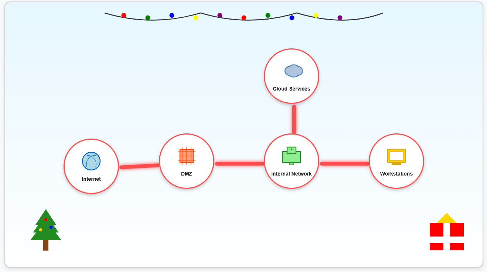
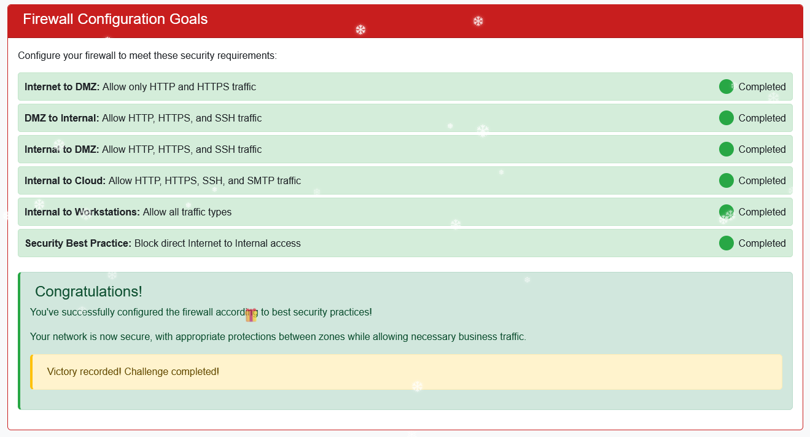

# Visual firewall thinger

**Difficulty**: :fontawesome-solid-star::fontawesome-regular-star::fontawesome-regular-star::fontawesome-regular-star::fontawesome-regular-star: 
**Direct link**: [Objective 5 website](https://visual-firewall.holidayhackchallenge.com/)

## Objective

!!! question "Request"
    Find Elgee in the big hotel for a firewall frolic and some techy fun.

??? quote "Chris Elgee"
    Welcome to my little corner of network security!  
    I've whipped up something sweeter than my favorite whoopie pie - an interactive firewall simulator that'll teach you more in ten minutes than most textbooks do in ten chapters.  
    Don't worry about breaking anything; that's half the fun of learning!  

The goal here is to understand how firewalls protect different network zones.
We then have to configure the firewall for each zone according to best practices.

## Solution

