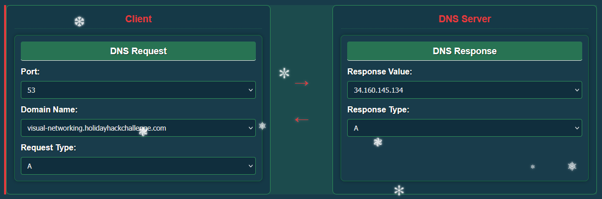
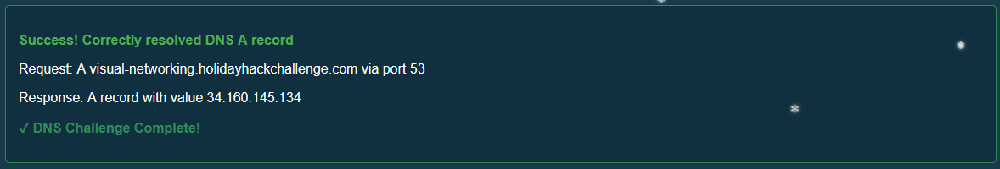
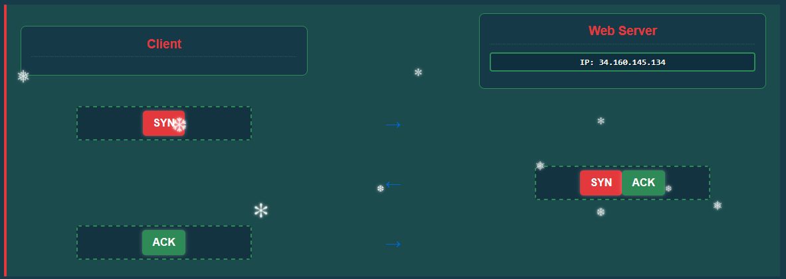
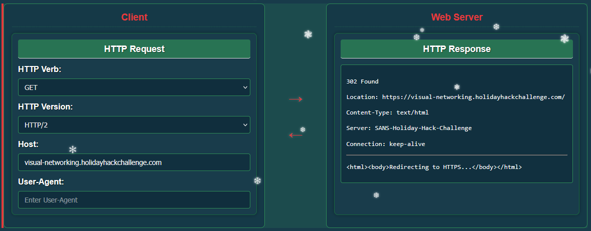
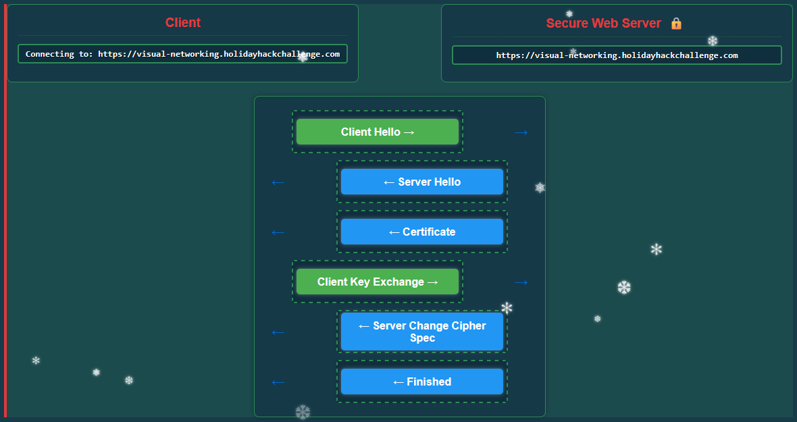
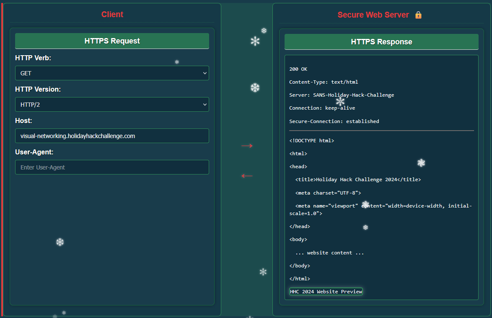

# Visual networking thinger

**Difficulty**: :fontawesome-solid-star::fontawesome-regular-star::fontawesome-regular-star::fontawesome-regular-star::fontawesome-regular-star: 
**Direct link**: [Objective 4 website]( https://visual-networking.holidayhackchallenge.com)

## Objective

!!! question "Request"
    Skate over to Jared at the frozen pond for some network magic and learn the ropes by the hockey rink.

??? quote "Jared Folkins"
    This interactive visualization I've created shows you exactly how packets travel, how protocols work, and why networks behave the way they do.  

    It's way better than staring at boring textbooks - you can actually see what's happening!  

    Want to dive into some hands-on network exploration? 

Let's dive into this visual network exploration to simulate a request to a webserver: visual-networking.holidayhackchallenge.com.

## Solution

First, perform a DNS lookup to find the IP address of the server:

Next, using the IP address of the webserver, create a TCP connection using a 3-way handshake between client and server:

The following step is to perform an HTTP Get Request to access the webpage:

The response from the server indicates a redirection using the HTTPS protocol instead of HTTP. We need to resend the request using the correct protocol.

For that, we initiate a secure connection through the TLS protocol. 
The TLS handshake creates a secure encrypted tunnel for HTTP traffic:

1. Client Hello: Client initiates secure connection with supported cipher suites 

2. Server Hello: Server responds with selected cipher suite 

3. Certificate: Server sends its SSL/TLS certificate 

4. Client Key Exchange: Client sends parameters for shared secret calculation 

5. Server Change Cipher Spec: Server indicates messages will be encrypted 

6. Finished: Server confirms handshake completion

We can finallly send the GET request to retrieve the website page securely.

