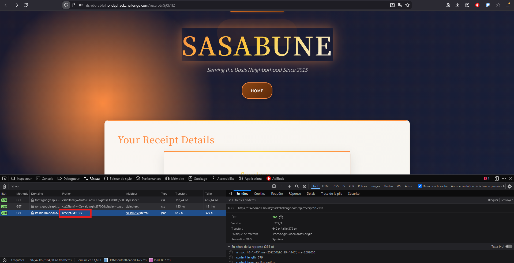
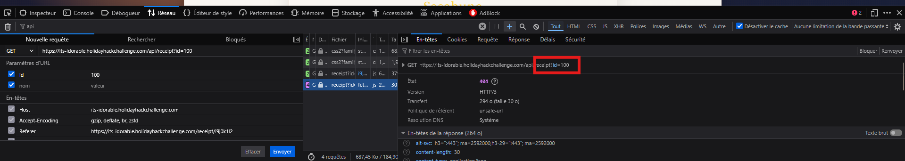
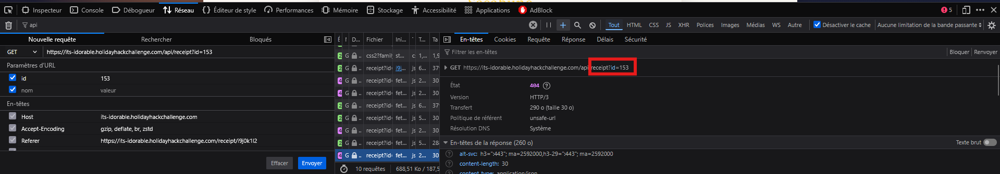
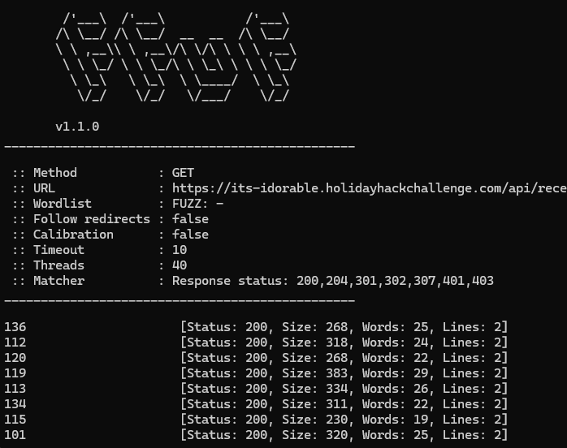
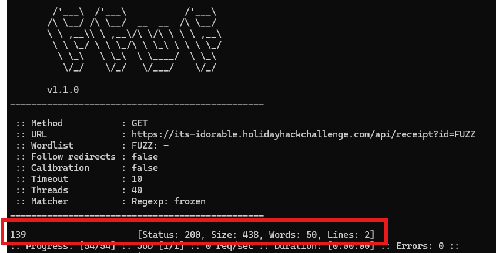
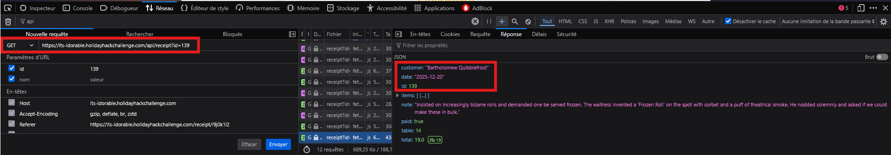

# Act 2: IDORable bistro

**Difficulty**: :fontawesome-solid-star::fontawesome-solid-star::fontawesome-regular-star::fontawesome-regular-star::fontawesome-regular-star:<br/>


## Objective

!!! question "Request"
    Josh has a tasty IDOR treat for you—stop by Sasabune for a bite of vulnerability. What is the name of the gnome?

??? quote "Insert Elf Name"
    I need your help with something urgent.<br/>
    A gnome came through Sasabune today, poorly disguising itself as human - apparently asking for frozen sushi, which is almost as terrible as that fusion disaster I had to endure that one time.<br/>
    Based on my previous work finding IDOR bugs in restaurant payment systems, I suspect we can exploit a similar vulnerability here.<br/>
    I was...at a talk recently...and learned some interesting things about some of these payment systems. Let's use that receipt to dig deeper and unmask this gnome's true identity.


## Solution

- See the output from a valid receipt <br/>
<br/>

- find the limits of available receipt: from 101 to 152<br/>
<br/>

<br/>

- Use fuzzing to analyze all receipts generated so far<br/>

```
sudo apt install ffuf

seq 100 153 | ffuf -w - -u "https://its-idorable.holidayhackchallenge.com/api/receipt?id=FUZZ"

```

<br/>

- Filter by orders containing frozen sushi<br/>
` seq 100 153 | ffuf -w - -u "https://its-idorable.holidayhackchallenge.com/api/receipt?id=FUZZ" -mr "frozen"`

Receipt 139 seams to be the one we are looking for<br/>

We have the name of the elf: **Bartholomew Quibblefrost**<br/>

<br/>

