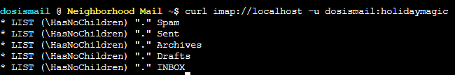
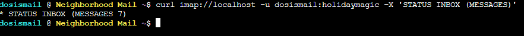
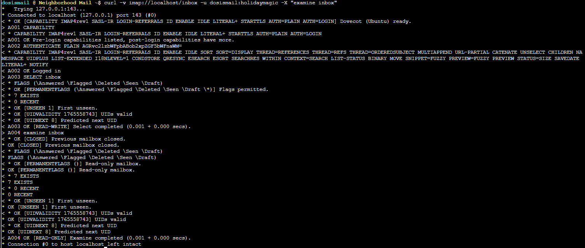
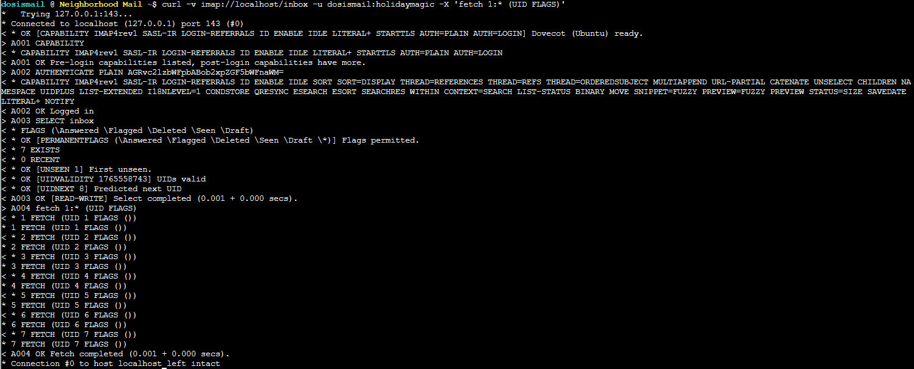
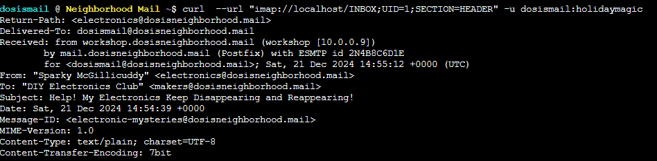
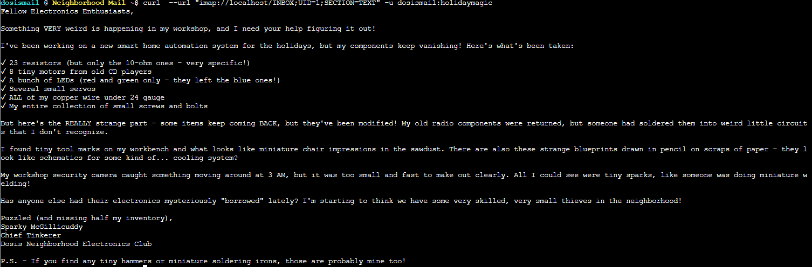
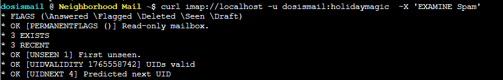
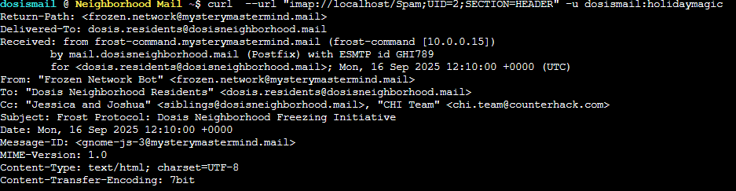
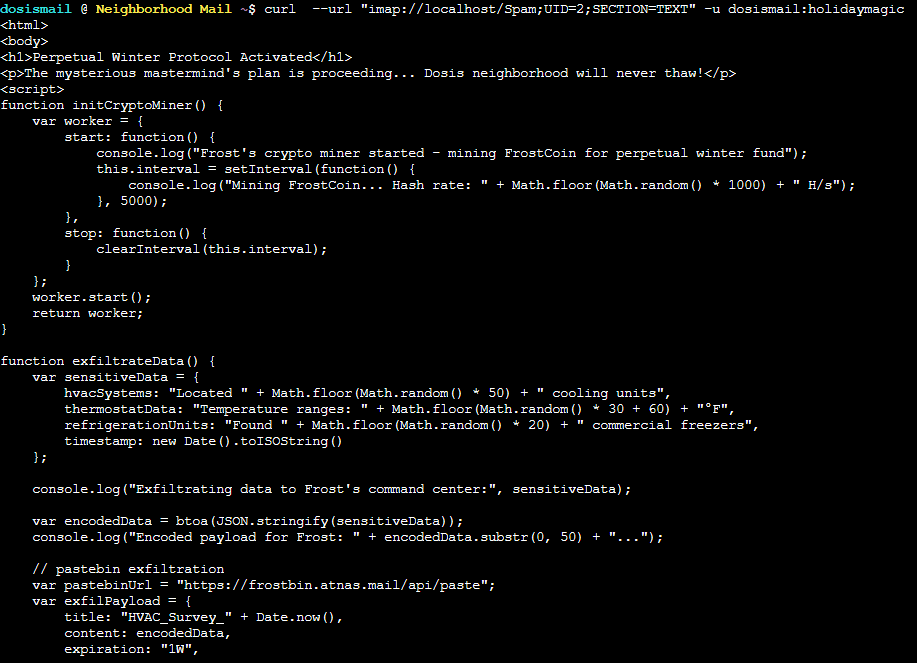

# Act 2: Mail detective

**Difficulty**: :fontawesome-solid-star::fontawesome-solid-star::fontawesome-regular-star::fontawesome-regular-star::fontawesome-regular-star:<br/>


## Objective

!!! question "Request"
    Help Mo in City Hall solve a curly email caper and crack the IMAP case. What is the URL of the pastebin service the gnomes are using?

??? quote "Maurice Wilson"
    So here's our situation: those gnomes have been sending JavaScript-enabled emails to everyone in the neighborhood, and it's causing chaos.<br/>
    We had to shut down all the email clients because they weren't blocking the malicious scripts - kind of like how we'd ground aircraft until we clear a security threat.<br/>
    The only safe way to access the email server now is through curl - yes, the HTTP tool!<br/>
    Think you can help me use curl to connect to the IMAP server and hunt down one of these gnome emails?

## Additional information

Use curl to safely connect to the IMAP server
and hunt down one of these gnome emails. Find the malicious email
that wants to exfiltrate data to a pastebin service and submit the URL
of that pastebin service in your badge.

 Server Info:
   The IMAP server is running locally on TCP port 143
   Backdoor credentials: dosismail:holidaymagic

## Solution

- Use curl to connect, port 143 per default<br/>
`curl imap://localhost -u dosismail:holidaymagic`<br/>

<br/>

- Explore the inbox
```
curl imap://localhost -u dosismail:holidaymagic  -X 'STATUS INBOX (MESSAGES)'
```

<br/>


` curl -v imap://localhost/inbox -u dosismail:holidaymagic -X "examine inbox"`<br/>




- Get current UIDs values because those can change if a message has been deleted<br/>
`curl -v imap://localhost/inbox -u dosismail:holidaymagic -X 'FETCH 1:* (UID FLAGS)'`<br/>



- Fetch messages
    - Get header<br/>
`curl  --url "imap://localhost/INBOX;UID=1;SECTION=HEADER" -u dosismail:holidaymagic`<br/>

<br/>
    - Get body<br/>

` curl  --url "imap://localhost/INBOX;UID=1;SECTION=TEXT" -u dosismail:holidaymagic`<br/>



- Find suspicious message:
    - Examine spam folder<br/>
`curl imap://localhost -u dosismail:holidaymagic  -X 'EXAMINE Spam'`<br/>



- Find suspicious message, look for pastebin content<br/>
```
curl  --url "imap://localhost/Spam;UID=2;SECTION=HEADER" -u dosismail:holidaymagic

curl  --url "imap://localhost/Spam;UID=2;SECTION=TEXT" -u dosismail:holidaymagic 
```

<br/>

