# Act 2: Quantgnome leap

**Difficulty**: :fontawesome-solid-star::fontawesome-solid-star::fontawesome-regular-star::fontawesome-regular-star::fontawesome-regular-star:<br/>


## Objective

!!! question "Request"
    Charlie in the hotel has quantum gnome mysteries waiting to be solved. What is the flag that you find?

??? quote "Charlie Goldner"
    I just spotted a mysterious gnome - he winked and vanished, or maybe he’s still here?<br/>
    Things are getting strange, and I think we’ve wandered into a quantum conundrum!<br/>
    If you help me unravel these riddles, we might just outsmart future quantum computers.<br/>
    Cryptic puzzles, quirky gnomes, and post-quantum secrets—will you leap with me?

A gnome appeared, then vanished.
We need to unravel quantum riddles.

## Solution


- Find the "PQC" executable<br/>
`find / pqc | grep pqc`<br/>
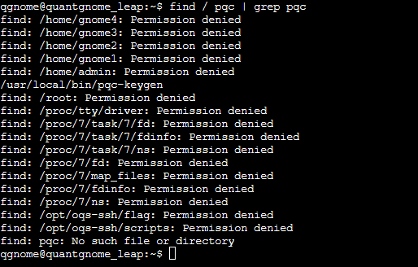

- Run executable<br/>
`/usr/local/bin/pqc-keygen`<br/>
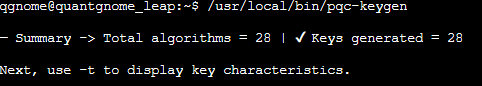

- Examine keys<br/>
`/usr/local/bin/pqc-keygen`<br/>
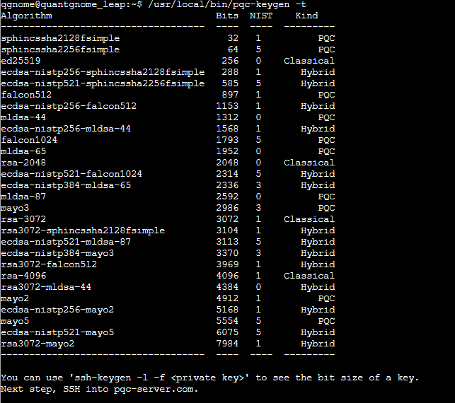

- Find the username for the ssh connection based on the pre existing ssh key:<br/>
-` more .ssh/id_rsa.pub `<br/>
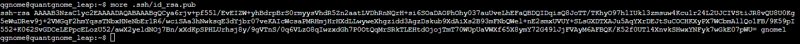<br/>

`ssh gnome1@pqc-server.com`<br/>

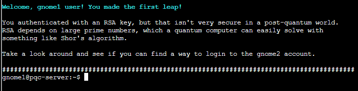


- Round and round you go<br/>
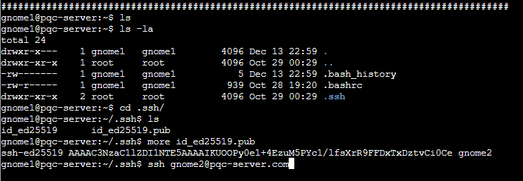

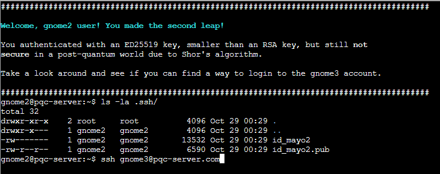

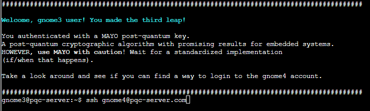
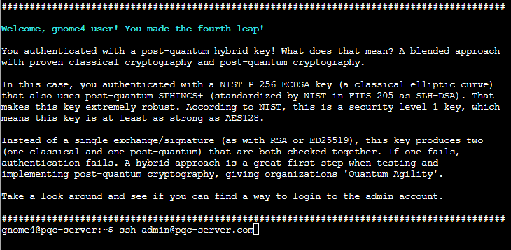
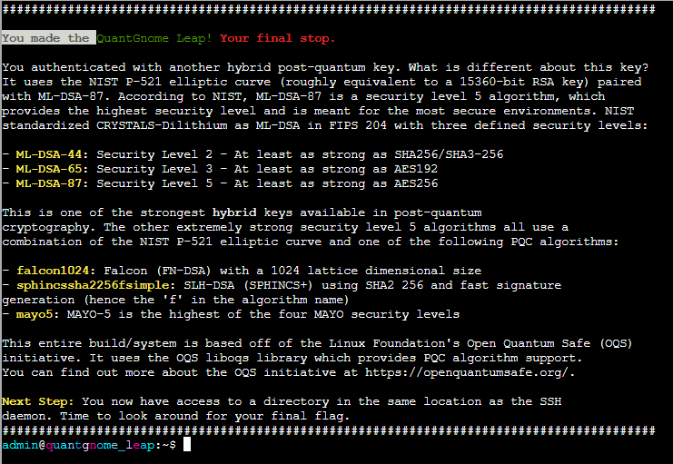

- ssh daemon location: `/opt/oqs-ssh/sbin`
```
 find / sshd|grep sshd
```

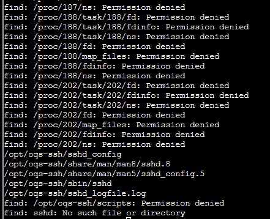
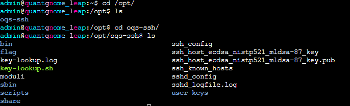
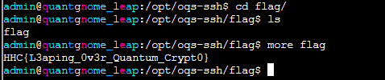

#### The flag is: HHC{L3aping_0v3r_Quantum_Crypt0}