# Act 2: Retro recovery

**Difficulty**: :fontawesome-solid-star::fontawesome-solid-star::fontawesome-regular-star::fontawesome-regular-star::fontawesome-regular-star:<br/>


## Objective

!!! question "Request"
    Join Mark in the retro shop. Analyze his disk image for a blast from the retro past and recover some classic treasures.

??? quote "Mark DeVito"
    While Kevin and I were cleaning up the Retro Store, we found this FAT12 floppy disk image, must have been under this arcade machine for years. These disks were the heart of machines like the Commodore 64. I am so glad you can still mount them on a modern PC.<br/>
    When I was a kid we shared warez by hiding things as deleted files.<br/>
    I remember writing programs in BASIC. So much fun! My favorite was Star Trek.<br/>
    The beauty of file systems is that 'deleted' doesn't always mean gone forever.<br/>
    Ready to dive into some digital archaeology and see what secrets this old disk is hiding?<br/>
    Go to Items in your badge, download the floppy disk image, and see what you can find!<br/>

## Solution

- Download the floppy disk image and mount it

```
wget https://www.holidayhackchallenge.com/2025/assets/floppy.img
mkdir /mnt/temp
mount -o loop floppy.img /mnt/temp
```

- Explore the file, seems to contain a quick basic emulator<br/>
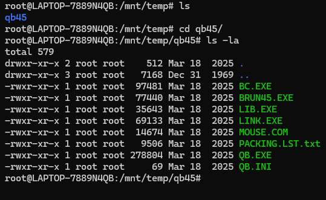

- Mark Devito mentionned something about hiding things in deleted files, with deleted files not being truly gone:
Let's use `testdisk` to recover deleted files on the floppy disk<br/>
`sudo testdisk floppy.img`<br/>

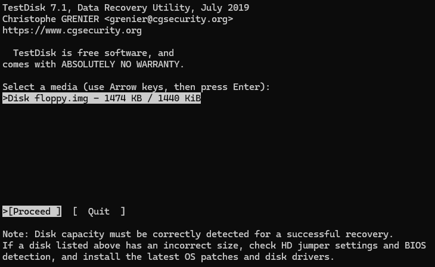<br/>
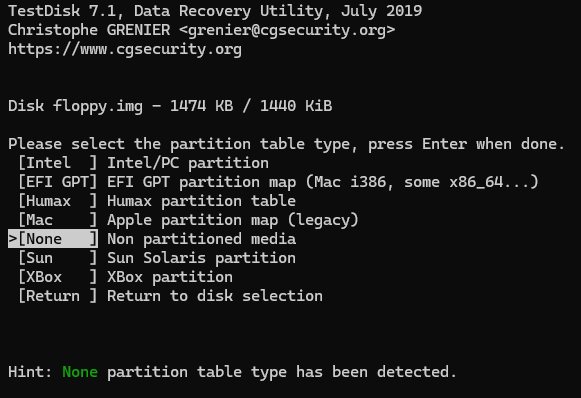<br/>
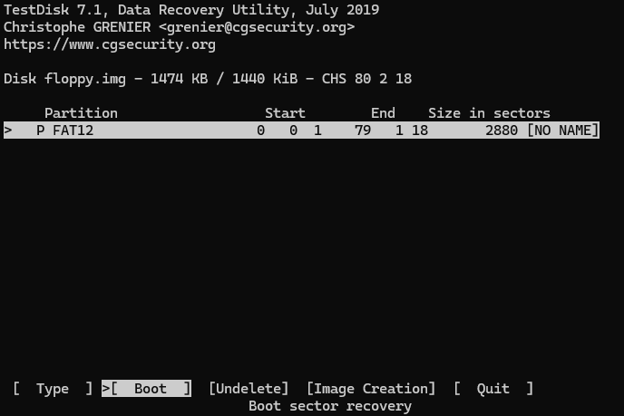<br/>
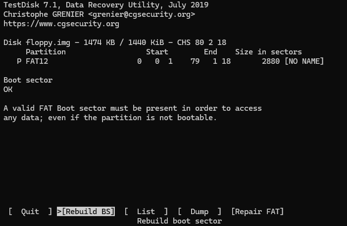<br/>
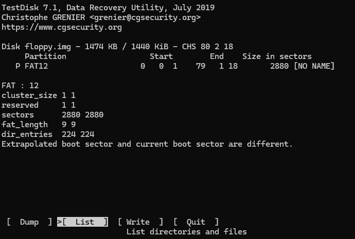<br/>
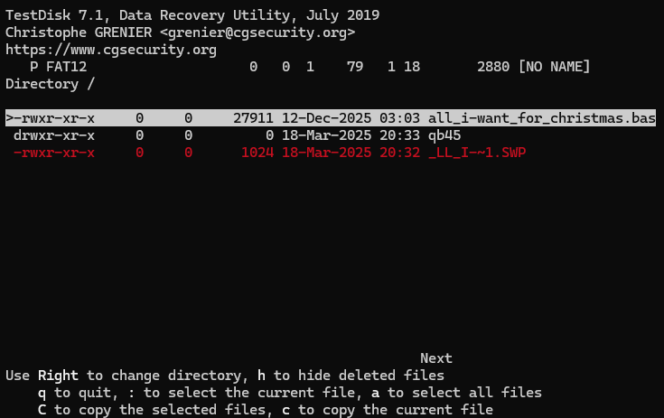<br/>

- Copy the recovered file to the desktop to explore it further<br/>
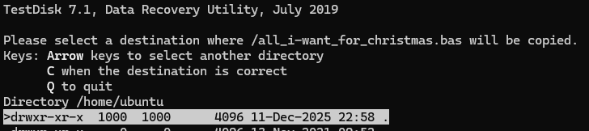<br/>


- Explore the file, look for possibly encoded characters<br/>
`grep -E '((([A-Za-z0-9+/]{4})*)([A-Za-z0-9+/]{4}|[A-Za-z0-9+/]{3}=|[A-Za-z0-9+/]{2}==))' all_i-want_for_christmas.bas`<br/>
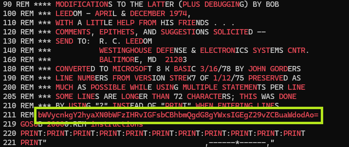

### Optional: Run the BASIC file

- copy the deleted file to the mounted folder<br/>
`cp all_i-want_for_christmas.bas /mnt/temp/`<br/>
- install and run `dosbox`<br/>
```
 sudo apt install dosbox
 dosbox
```

- mount the `/mnt/temp` folder<br/>
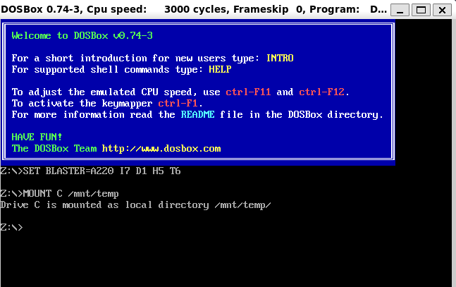<br/>
- access the newly mounted folder and launch the basic emulator<br/>
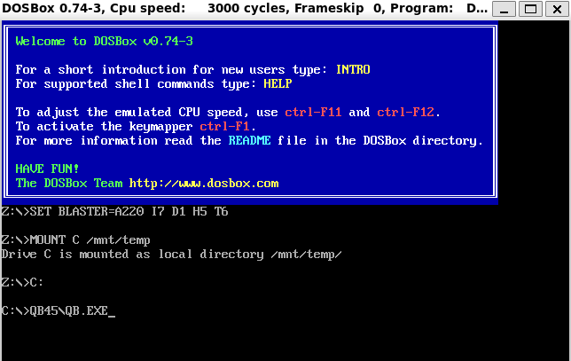<br/>
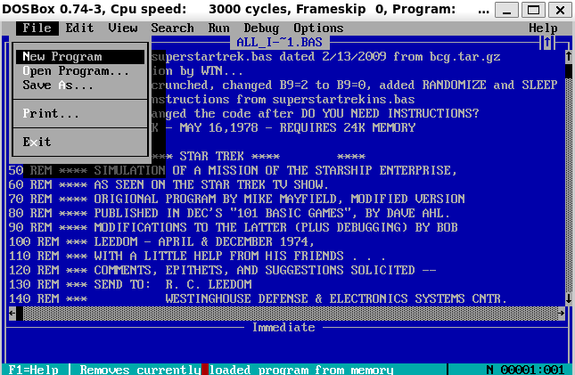<br/>
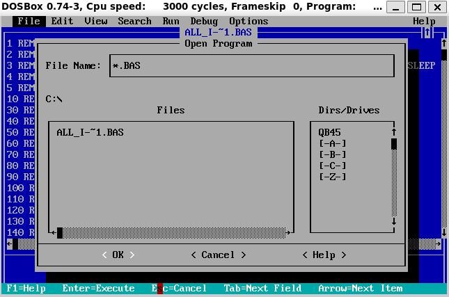<br/>
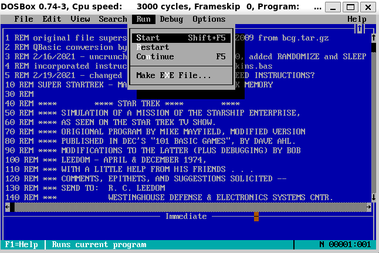<br/>
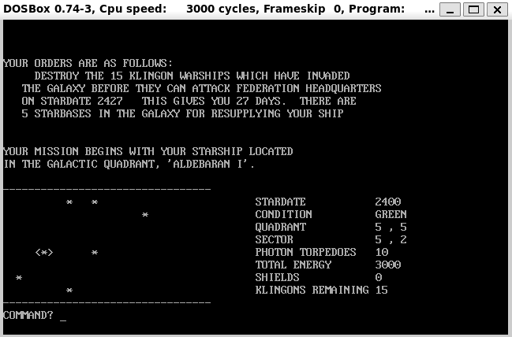

