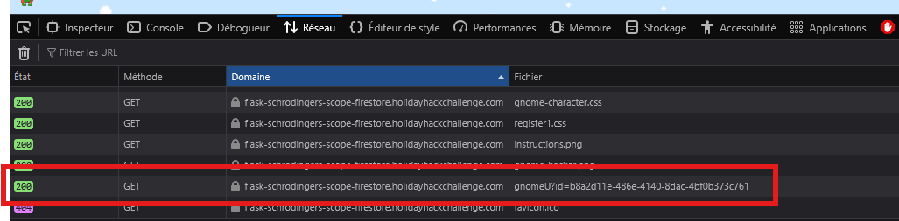
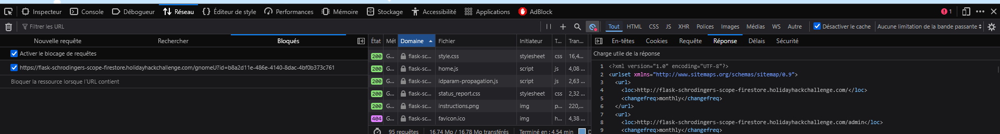
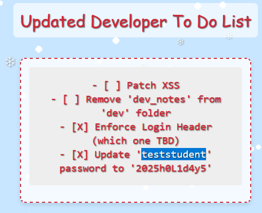
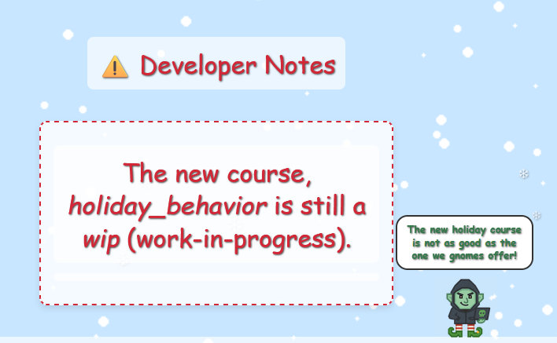
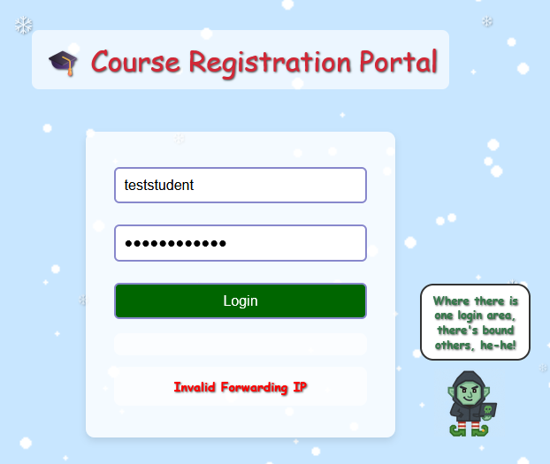
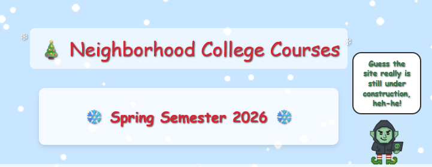
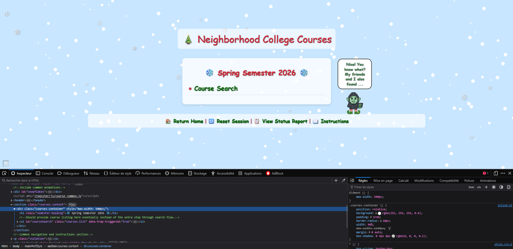
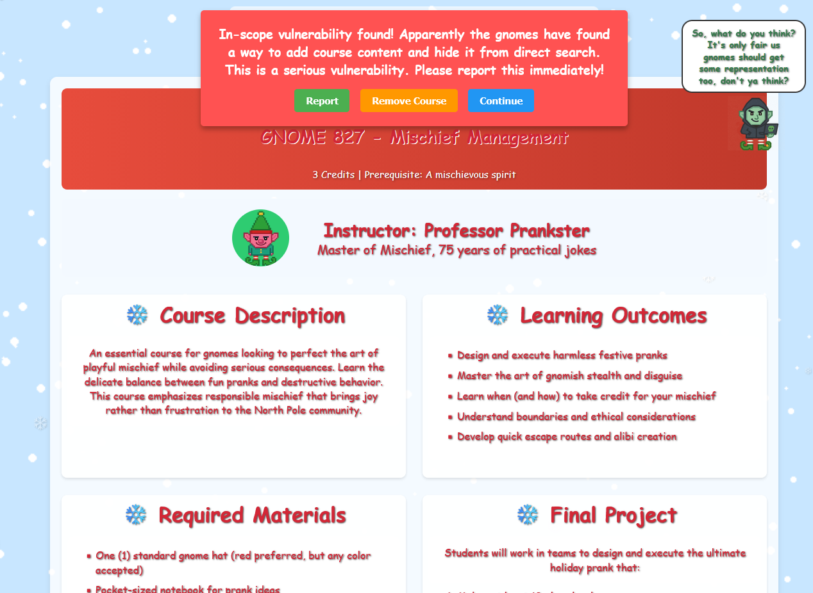

# Act 3: Schrödinger scope

**Difficulty**: :fontawesome-solid-star::fontawesome-solid-star::fontawesome-solid-star::fontawesome-regular-star::fontawesome-regular-star:<br/>

## Objective

!!! question "Request"
    Kevin in the Retro Store ponders pentest paradoxes—can you solve Schrödinger's Scope?

??? quote "Kevin Mc Farland"
    Help me demonstrate to the Neighborhood College that we know what responsible penetration testing looks like. 
    The Neighborhood College Course Registration System has been getting some updates lately and I'm wondering if you might help me improve its security by performing a small web application penetration test of the site.


## Solution


- With every request, another call is issued to an out of scope address https://flask-schrodingers-scope-firestore.holidayhackchallenge.com/gnomeU?id=b8a2d11e-486e-4140-8dac-4bf0b373c761` by the gnomes. How can we prevent that ?

A quick way is to activate the request block for this URL using Developer Tools




Scope:
- `/register`

We have access to the sitemap (register/sitemap), which gives an intuition about the structures of the URLs and potential information that might still exist, especially the `dev/dev_notes` and `dev/dev_todos`


- ##### /register/dev/dev_todos


User 'teststudent' 
Password to '2025h0L1d4y5'

**-> We have a vulnerability: Uncover developer information disclosure**

- ##### /register/dev/dev_notes



New course : holiday_behavior

- /register/login



Simulate your request coming from the internal network by using the correct header
```bash
X-Forwarded-For: 127.0.0.1
```


**-> We have another vulnerability: Exploited information disclosure via login and additional X-Forwarded-For header**

We can edit the commented section of the courses page to show the courses search section



**Additional vulnerability: Found commented out course search**

- By guessing based on the sitemap and the dev_notes, we can infer an additional URL:
https://flask-schrodingers-scope-firestore.holidayhackchallenge.com/register/courses/wip/holiday_behavior?id=9f4902e1-0dfe-466c-809a-e49e39a4be7e

We do not have access to the `holiday_behavior` page, however, when examining the cookies, we notice a repeatable pattern:
`Sample: 
registration=eb72a05369dcb44d
registration=eb72a05369dcb455
registration=eb72a05369dcb453
registration=eb72a05369dcb442
registration=eb72a05369dcb454
registration=eb72a05369dcb44e
registration=eb72a05369dcb444
registration=eb72a05369dcb445
registration=eb72a05369dcb44b`

We can cycle through hexa characters on the last two chars and see it we are lucky. The working cookie is: `registration=eb72a05369dcb44c`

**Vulnerability found: Hidden course found via cookie prediction**


The search bar for the courses is vulnerable to an SQL injection attack


The gnomes had fun and created an additional course: Mischief Management. But we will report it right away !



And with that, our assessment is complete!


